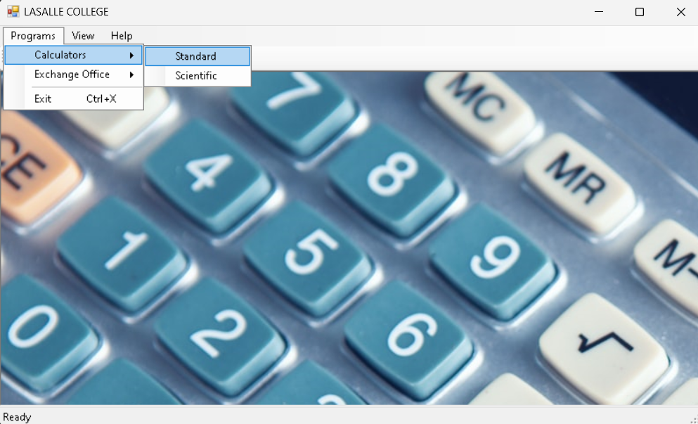
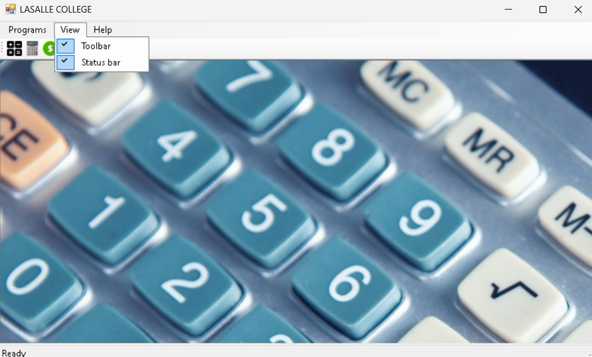
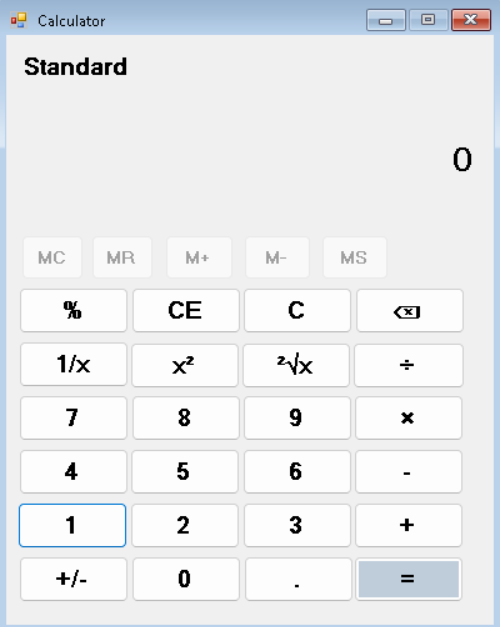
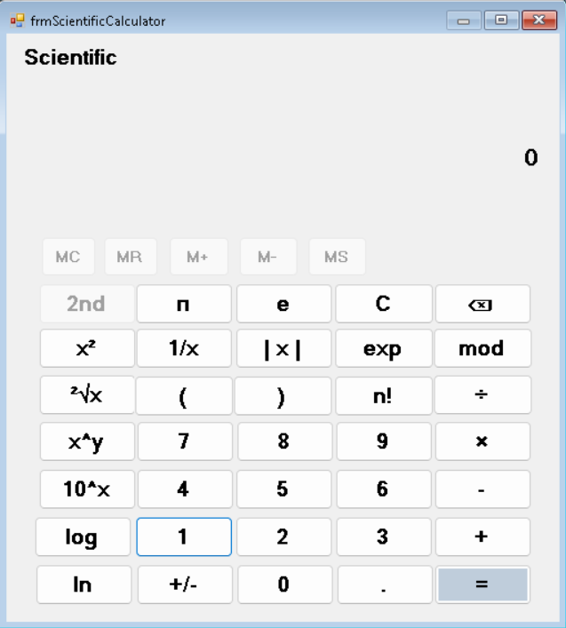
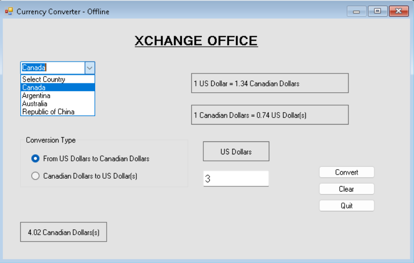

# Calculator

This GitHub repository contains a versatile calculator application developed in C# using Windows Forms with .NET Framework. The application provides three main functionalities: a Simple Calculator, a Scientific Calculator, and a Currency Converter (in offline mode) using data from a text file.

## Table of contents

  - [Features](#features)
  - [Screenshots](#screenshots)
  - [Prerequisites](#prerequisites)
  - [Getting Started](#getting-started)
  - [Usage](#usage)
  - [Data Source for Currency Converter](#data-source-for-currency-converter)
  - [Author](#author)


## Features

### 1. Simple Calculator

The Simple Calculator offers basic arithmetic operations, including addition, subtraction, multiplication, and division. Users can perform calculations with ease, making it suitable for everyday math tasks.

### 2. Scientific Calculator

The Scientific Calculator extends the functionality by providing advanced mathematical operations and functions. It includes trigonometric functions, logarithms, exponentiation, and more, making it a powerful tool for complex calculations.

### 3. Currency Converter (Offline Mode)

The Currency Converter allows users to convert between different currencies. It operates in offline mode, which means it uses exchange rate data stored in a text file. This feature is useful for quick currency conversion without requiring an internet connection.

## Screenshots






## Prerequisites

To build and run this calculator application, you will need:

- Visual Studio 2022 or a compatible development environment for C#.
- .NET Framework installed on your machine.

## Getting Started

Follow these steps to get started with the Calculator application:

1. Clone this repository to your local machine:

   ```bash
   git clone https://github.com/thevarungrovers/Calculator.git
   ```

2. Open the project in Visual Studio 2022.

3. Build the project to ensure all dependencies are resolved.

4. Run the application to launch the Calculator.

## Usage

1. Select the calculator mode you want to use: Simple Calculator or Scientific Calculator.

2. Use the buttons and features provided to perform calculations:

   - For Simple Calculator, use the basic arithmetic buttons (addition, subtraction, multiplication, division) and the equals (=) button to obtain results.

   
   
   - For Scientific Calculator, explore the extended mathematical functions provided in the interface.

   

   - To use the Currency Converter, click on the "Currency Converter" button and follow the on-screen instructions to convert between currencies using the offline exchange rate data.

   

## Data Source for Currency Converter

The Currency Converter operates in offline mode by using exchange rate data from a text file named `currency.txt` located within the repository. You can update this file with the latest exchange rates as needed.

## Author

- GitHub - [@thevarungrovers](https://www.github.com/thevarungrovers)

Thank you for using the Calculator application!

**Happy Calculating!**